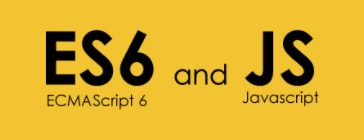
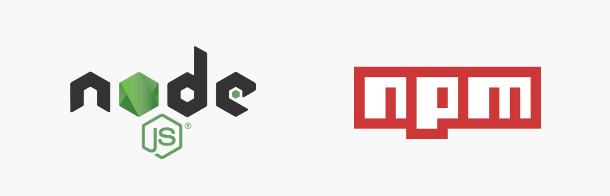
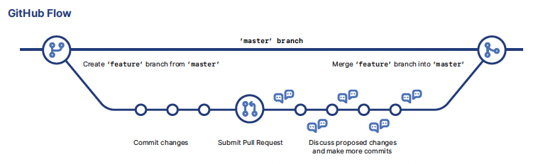

<br/>
<br/>

<p align="center">
   
</p> 

# Basic installations and settings
Before we start with our development or download and installation of the project, we must take into account the following requirements for the use of our tools.  
There are some mandatory installations and some other that are simple recomendations but here you have a few tools that can help on the process.  

### *VSCode*
In this case we will use Visual Studio Code as the default IDE ( https://code.visualstudio.com/ )
<br/>

### *Node*
Node.js ( https://nodejs.org/es/ ) remember to install the stable versions.  
to check Node was installed properly or you just have a functional version, open a terminal window and the following commands:

```
node --version
```

### *Browser*
For our developments we will work with the latest versions of Google Chrome due the debugging process is quite easy to perform thanks to the development tools already integrated.  
In case you prefer to use another browser such as edge or firefox, you can proceed without any problem.
<br/>

### *Git*
The tools to use here could be different in function of your actual service or preferences.  
The two best known and free options to manipulate your repository are GitHub and GitLab.  
And Remember Git is not the same thing to GITHUB, **Git is an open source for versioning control and GitHub is a platform for hosting git repositories**.  

Git Download ( https://git-scm.com/ ).  
Git Documentation ( https://git-scm.com/doc ).  

<p align="center">
  
</p>


to check the git installation, the command is similar to the previous command for Node on the console.
```
git --version
```

We need to perform the configuration settings in this case:
```
git config --global user.name "[name]"
//set the name you want attached to your commit transactions

git config --global user.email "[email address]"
//set the email you want attached to your commit transactions
```

Other basic commands related to git to keep in mind
```
git init

git config --list

git clone [url]

git fetch

git merge

git pull

git add .

git commit -m "[descriptive message]"

git push
```

### *NPM*
Throughout the development that you must implement, you will possibly use npm on numerous occasions, but when it comes to making a more stable configuration for your UI5 project, the following installation is recommended to be testable in any browser using npm and babel ( https://www.npmjs.com/package/ui5-task-transpile )

After following the steps described on the npm link, we create a simple example for ES6 code to see the differences after build ( see filles: index.js )
```
# index.js
// START simple test for ES6
	const myInfo = {
		firstName: "Jean-Carlo",
		city: "Brussels" 
	};

	const hobbies = ['padel', 'warhammer40k', 'comics'];
	let modifiedInfo = { ...myInfo, lastName: 'León', hobbies};
	console.table(modifiedInfo);

	const sayHi = ( name = 'No name') => {
		alert ( `${ name } says HI!!!` );
	}

	sayHi();

// END simple test for ES6
```

```
# index.js minimized
[...] var t=_objectSpread(_objectSpread({},e),{},{lastName:"León",hobbies:r});var n=function e(){var r [...]

// where we can see the convertion of the spread, arrow functions, const and lets, etc
```


<br/>
<br/>

### *Optional installations*
Json Viewer Awesome for chrome ( https://chrome.google.com/webstore/detail/json-viewer/gbmdgpbipfallnflgajpaliibnhdgobh ).  
Material Icon Theme for VSCode ( https://marketplace.visualstudio.com/items?itemName=PKief.material-icon-theme ).  
Latest version of VSC already have this extension by default but in case of need this is the link for:  
Bracket Pair Colorizer 2 ( https://marketplace.visualstudio.com/items?itemName=CoenraadS.bracket-pair-colorizer-2 ).  
HTML Snippets ( https://marketplace.visualstudio.com/items?itemName=abusaidm.html-snippets ).  

<br/>
<br/>

<p align="center">
  
</p>  

# UI5 Tooling  
It is highly recommended to take a look at the UI documentation ( https://sap.github.io/ui5-tooling/ - https://github.com/SAP/ui5-tooling ), here we are going to proceed only with some basic and necessary steps to proceed with the template.  
UI5 Tooling: is the open-source, modular, configurable and extensible command line interface (CLI) for efficient development of applications, libraries and reuse of components with the UI5 framework.  

Installation:
```
# Global installation to have the command available
npm install --global @ui5/cli

# Additional local install in your project
npm install --save-dev @ui5/cli

# Verify installation
ui5 --help
```

To check the installation or if you already have one previous version:

```
ui5 -v
```

For the following steps you need to create a basic structure, and to achieve that we can use Yeoman generator a tool 
which enables you to create simple SAPUI5/OpenUI5-based web-apps and other UI5-related projects within seconds ( https://github.com/SAP/generator-easy-ui5 ).  

In our case we will only set the basic to set the template so we create the basic webapp for our Hello World!  
Now proceed to generate the package.json file and the yaml file
```
npm init --yes
ui5 init
```

Proceed with the template to create the complete webapp structure to the point of the manifest.json

```
# Define the framework you want to use
ui5 use sapui5@latest

# Add required libraries to the yaml file
ui5 add sap.ui.core sap.m sap.ui.table themelib_sap_fiori_3

# Start the server and work on your project! 
ui5 serve
```

<br/>
<br/>

